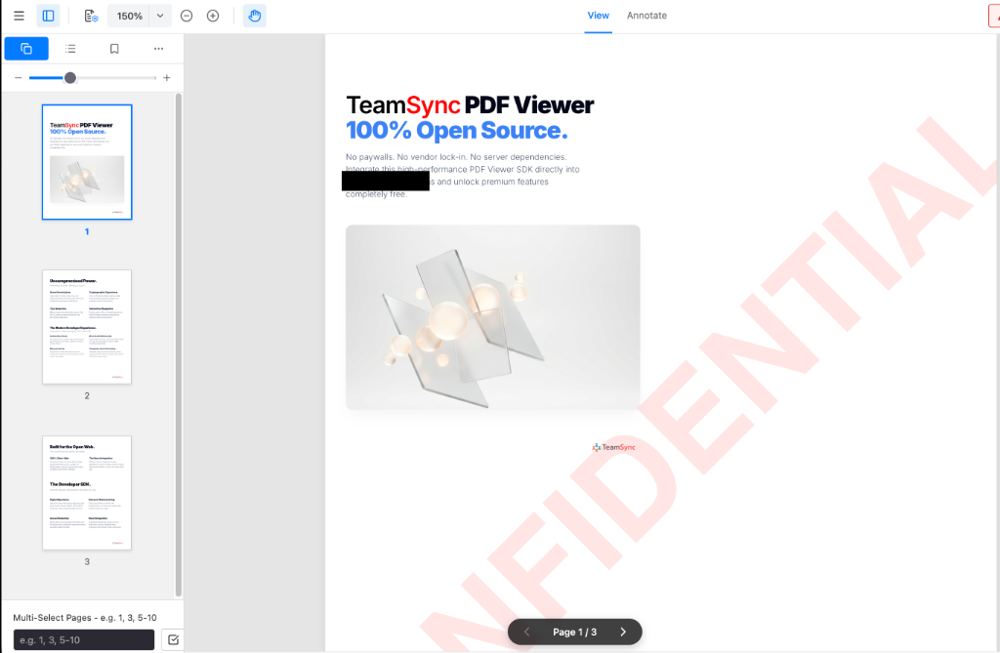

# TeamSync PDF Viewer SDK

<div align="center">



### **100% Open Source. 100% Client-Side. Enterprise PDF Engine.**

[](LICENSE)
[](https://reactjs.org/)
[](https://vitejs.dev/)
[](https://www.typescriptlang.org/)
[]()

*No paywalls. No vendor lock-in. No server dependencies.*  
Integrate a high-performance, drop-in PDF Viewer SDK directly into your React applications and unlock commercial-grade features completely free.

</div>

---

## 🚀 Why TeamSync PDF Viewer?

Traditional commercial PDF viewers force developers into expensive per-domain licenses, opaque sales calls, and heavy server-side processing dependencies. **TeamSync PDF Viewer** is built from the ground up to solve these pain points.

- 💰 **Zero-Cost, Transparent Licensing**: Uncapped usage, no per-server fees, and no $10k+/yr commercial paywalls. 100% free and open-source under CPAL 1.0.
- ⚡ **100% Client-Side WebAssembly**: Documents never leave the browser sandbox. Process, redact, sign, and render PDFs entirely on the client—guaranteeing instant **HIPAA**, **GDPR**, and **FINRA** compliance.
- 🔌 **Universal WebViewer API**: Clean, intuitive `WebViewer({...})` API interface that makes integrating into your web applications effortless.
- 🎨 **Headless & Customizable**: Built for modern React 19 SPA lifecycles. No bloated iFrames to fight—customize toolbars, sidebars, context menus, and controls natively.

---

## ✨ Uncompromised Feature Set

Everything you need to build collaborative, secure document workflows.

### 🎨 Smart Markup & Annotations
- **Full Drawing Toolkit**: Freehand ink (`brush`), highlighters, geometric shapes (rectangles, ellipses), arrows, and lines.
- **Notes & Callouts**: Sticky notes, callout text boxes with directional arrows, and text annotations.
- **Interactive Hyperlinks**: Create internal page-jump links (`#page=N`) or external web URL links directly on document selections.

### 🔐 Cryptographic PKI & USB Digital Signatures
- **Local P12 / Certificate Signing**: Native in-browser PKI signing using X.509 digital certificates and private keys.
- **Hardware Token / USB Smart Card**: Real-time integration with USB Smart Cards (e.g. ePass2003, AETokens) via a local bridge service for ADeS/eIDAS compliance.
- **Simple & Handwritten Signatures**: Draw, type, or upload image signatures with customizable timestamps and signer identity verification.

### 🛡️ Military-Grade Secure Redaction
- **Binary-Level Data Obliteration**: We don't just place black boxes over text—redactions are permanently rasterized and burned into the underlying PDF vector structure.
- **Text Layer Sanitization**: Redacted text is automatically stripped from the DOM `textLayer` and PDF content streams, preventing copy/paste extraction and search indexing.
- **Automatic Regex Redactions**: Programmatically locate and redact sensitive PII (Aadhaar numbers, SSNs, credit cards, dates of birth) in a single click.

### 🔍 High-DPI Canvas Rendering & Search
- **Retina 60 FPS Zoom & Pan**: High-DPI `devicePixelRatio` scaling eliminates blurred text. Micro-debounced rendering enables buttery-smooth 60 FPS trackpad pinching and 360° mouse drag panning.
- **Contextual Document Search**: Instant client-side text search with real-time match highlighting, result jumping, and match counting.

### 💧 Dynamic Forensic Watermarking
- Programmatic, non-destructive watermarks rendered on the fly (single centered or full-page tiled) with customizable text, color, opacity, font size, and rotation.

---

## 🛠️ Quick Start

### 1. Installation

Clone the repository and install dependencies:

```bash
git clone https://github.com/angelbot-ai/TeamSync-PDF-Viewer.git
cd TeamSync-PDF-Viewer
npm install
```

### 2. Launch Development Server

```bash
npm run dev
```

Open `http://localhost:5173` in your browser to launch the live SDK viewer.

---

## 💻 Developer SDK Usage

### Standard WebViewer Initialization

Drop the SDK into any container element with a single function call:

```typescript
import { WebViewer } from './main';

WebViewer({
  initialDoc: '/sample.pdf',
  initialScale: 1.0, // 100% natural size
  enableAnnotations: true,
  permissions: {
    canRedact: true,
    canSign: true,
    canAddAnnotations: true
  },
  watermark: {
    text: 'CONFIDENTIAL',
    mode: 'single',
    size: 48,
    opacity: 0.1,
    color: '#dc2626'
  },
  regexRedactions: [
    /\d{4} \d{4}(?= \d{4})/g, // Auto-redact first 8 digits of 12-digit IDs
    /DOB: \d{2}\/\d{2}\/\d{4}/g // Auto-redact Dates of Birth
  ]
}, document.getElementById('viewer-container')).then((instance) => {
  console.log('TeamSync PDF Viewer is ready!', instance);
  
  // Export annotated / signed PDF buffer
  instance.Core.documentViewer.getDocument().getFileData().then((pdfBytes) => {
    console.log('Exported PDF byte length:', pdfBytes.length);
  });
});
```

### React Component Usage

For native React integration, use the `<DocumentViewer />` component:

```tsx
import { DocumentViewer } from './components/DocumentViewer';

function App() {
  return (
    <div style={{ width: '100vw', height: '100vh' }}>
      <DocumentViewer
        initialDoc="/contract.pdf"
        scale={1.0}
        enableAnnotations={true}
        permissions={{ canSign: true, canRedact: true }}
      />
    </div>
  );
}
```

---

## 🏛️ Architecture & Modern Tech Stack

- **Core Engine**: HTML5, TypeScript, WebAssembly (PDF.js + pdf-lib)
- **UI & State**: React 19, Lucide Icons, Pure CSS Modules
- **Cryptographic Security**: Node-Forge (PKI / ASN.1 / X.509 parsing)
- **Build System**: Vite 8 & Oxlint (Sub-500ms tree-shakable builds)

```
TeamSync-PDF-Viewer/
├── src/
│   ├── components/       # Native React UI (Header, DocumentViewer, Sidebars, Modals)
│   ├── hooks/            # Search & Keyboard shortcut hooks
│   ├── utils/            # Cryptographic PDF signing & Regex redaction algorithms
│   ├── main.tsx          # WebViewer SDK entry point & public API bridge
│   └── App.tsx           # Demo Application Shell
├── usb-bridge/           # Local Node.js USB Smart Card Token Service
├── public/               # Static PDF assets & PDF.js workers
└── docs/images/          # High-res UI documentation screenshots
```

---

## ⚡ Hardware Token & USB Signing (Optional)

To enable hardware-based digital signing using USB Smart Cards / Tokens (ADeS / eIDAS):

```bash
cd usb-bridge
npm install
node bridge.js
```

The viewer automatically detects the local bridge on `ws://localhost:8080` and enables native USB token digital signing.

---

## 📄 License

Distributed under the **CPAL 1.0 (Common Public Attribution License)**.  
100% Free and Open Source for personal and commercial usage.

---

<div align="center">
  <b>TeamSync PDF Viewer Engine</b> • Engineered with ❤️ for the Open Web.
</div>
